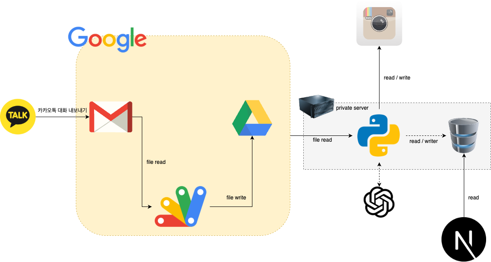

# Autogram

Autogram은 카카오톡 채팅방의 대화 내용을 기반으로, 품앗이(상호 간의 협력 및 지원 행위)가 제대로 이행되었는지 주기적으로 검증하고, AI를 활용하여 품앗이 작업을 자동화하는 프로젝트입니다.  
본 프로젝트는 Google 서비스 및 다양한 외부 플랫폼과 연동되어, 품앗이 운영의 효율성과 투명성을 극대화합니다.

---

## 주요 기능

- **카카오톡 대화 내역 자동 수집**
- **Google Apps Script, Gmail, Drive를 활용한 파일 관리 및 자동화**
- **Python 서버에서 채팅 내용 분석 및 품앗이 검증**
- **Instagram 품앗이 자동화 및 검증**

---

## 시스템 구성도

---

## 시스템 흐름

1. **카카오톡 대화 내보내기**  
   사용자가 카카오톡 채팅방 대화 내역을 내보내기하여 Gmail로 보냅니다.

2. **Gmail → Apps Script → Google Drive**  
   Google Apps Script가 Gmail에서 파일을 읽어 Drive에 저장합니다.

3. **배치(Python) 연동**  
   프라이빗 서버가 구글 드라이브의 파일을 읽어와 품앗이 내역을 검증합니다.

4. **Instagram 연동**  
   Python 서버가 Instagram API와 자동화 스크립트를 사용해 품앗이 실행/검증을 담당합니다.

---

## 사용 기술

- Google Apps Script
- Gmail/Google Drive API
- Python (데이터 분석 및 자동화)
    - openai
    - google oauth2
    - discord
    - SQLAlchemy
    - inotifywait
- Instagram API

---

## 프로세스 정리

1. 카카오톡 대화 내보내기 기능을 이용해 대화 파일을 등록된 Gmail로 전송
2. Google Apps Script를 통해 Gmail 첨부파일이 자동으로 Google Drive에 저장
3. Python 서버가 지정 주기마다 Google Drive에서 파일을 불러와 스토리지에 저장
4. `inotifywait`로부터 업데이트된 파일에 대해서 Instagram API와 자동화 스크립트을 이용해 실제 품앗이 액션을 자동 실행/검증

---

## 프로젝트 목적

- 품앗이 내역의 투명성 및 신뢰성 강화
- 업무 자동화로 인한 시간 절약 및 오류 최소화
- AI/자동화를 통한 품앗이 프로세스의 지능화